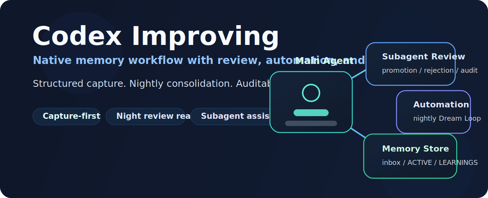
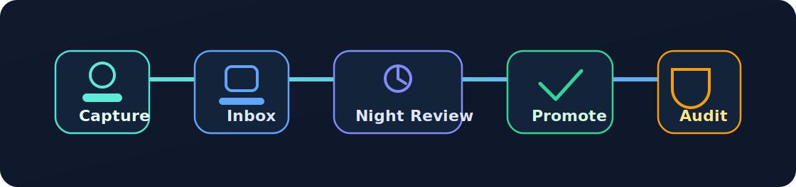

# Codex Improving

中文 | [English](README.md)

> 一个面向 Codex 的结构化记忆、审查与夜间整理工作流。

- 工作时采集
- 空闲时整理
- 关键判断走 subagent 复核

## 它解决什么问题

很多 AI 记忆方案最后都会出问题，通常是因为：

1. 把稳定规则、临时上下文、错误经验和未来想法混在同一个地方。
2. 在 agent 还在执行当前任务时，就开始改写长期记忆。

`codex-improving` 走的是相反的路线：先采集，再整理；把 `AGENTS.md` 当稳定入口；把重要的升级、拒绝和归档判断放进可审计的 review 流程，而不是静默重写。

这个项目不是想把 Codex 做成另一个 Claude Code，而是把 Codex 自己已经擅长的原生能力真正接起来：

- `AGENTS.md`
- skills
- automations
- worktrees
- sandbox 与权限
- subagents

## 它怎么工作

整条 Dream Loop 很简单：

- 在工作中记录高信号观察
- 先写进 `inbox/`，不动长期记忆
- 夜间做 review 和 consolidation
- 只有在“重复出现、可泛化、可执行”时才升级
- 所有改动都要留下审计痕迹

### 记忆分层

| 层级 | 作用 |
| --- | --- |
| `AGENTS.md` | 稳定规则与入口指导 |
| `inbox/` | 只追加的采集流 |
| `ACTIVE.md` | 当前阶段高频且重要的规则 |
| `LEARNINGS.md` | 稳定、跨任务可复用的经验 |
| `FEATURE_REQUESTS.md` | 未来能力缺口与自动化机会 |

### 审查模型

- `capture-memory` 默认保持轻量单 agent
- `dream-consolidate` 在 promotion、rejection、archive、冲突判断时优先走 subagent 交叉复核
- 纯低风险清理可以继续走单 agent fast path
- `AGENTS.md` 永远不允许自动改写

## 仓库里有什么

- [`skills/capture-memory/`](skills/capture-memory/SKILL.md)
  用于白天采集纠正、重复失败、稳定偏好和可复用 workflow 信号。
- [`skills/dream-consolidate/`](skills/dream-consolidate/SKILL.md)
  用于夜间去重、失效处理、升级判断和审计输出。
- [`templates/global/`](templates/global/AGENTS.snippet.md)
  提供全局 `AGENTS.md` 片段和 memory 初始化模板。
- [`automations/`](automations/nightly-dream-loop.md)
  提供推荐的夜间自动化 prompt 与调度方式。
- [`examples/minimal-global/`](examples/minimal-global/nightly-report-example.md)
  给出一个最小的 Dream Loop 报告示例。
- [`references/`](references/promotion-rules.md)
  补充 promotion rules、scope、audit、evals 和 automation 设计说明。

## 快速开始

1. 把 `skills/capture-memory/` 和 `skills/dream-consolidate/` 复制到 `$CODEX_HOME/skills/` 或 `~/.codex/skills/`。
2. 把全局模板复制进你的 Codex home，并把片段接进 `AGENTS.md` 入口。
3. 白天用 `capture-memory` 往 `inbox/` 追加高信号记录。
4. 夜间用 `dream-consolidate` 做整理，并先 review 报告，再信任升级结果。

## 实际会怎么用

一个很典型的场景：

1. 用户纠正了一次重复出现的工作流错误。
2. `capture-memory` 把这条观察写进 `inbox/`。
3. 夜间整理读取相关证据，并用 reviewer subagent 做交叉判断。
4. 如果这条模式已经稳定且可复用，就提升到 `ACTIVE.md` 或 `LEARNINGS.md`。
5. 审计报告会记录改了什么、拒绝了什么、原因是什么。

## 项目说明

- 这是一个刻意保持轻量的个人项目。
- 重点是把 Dream Loop workflow 做稳，而不是先做成大平台。
- 如果以后要扩展到团队场景，建议先扩充模板和 review 机制，再扩展自动化面。

## License

[MIT](LICENSE)
