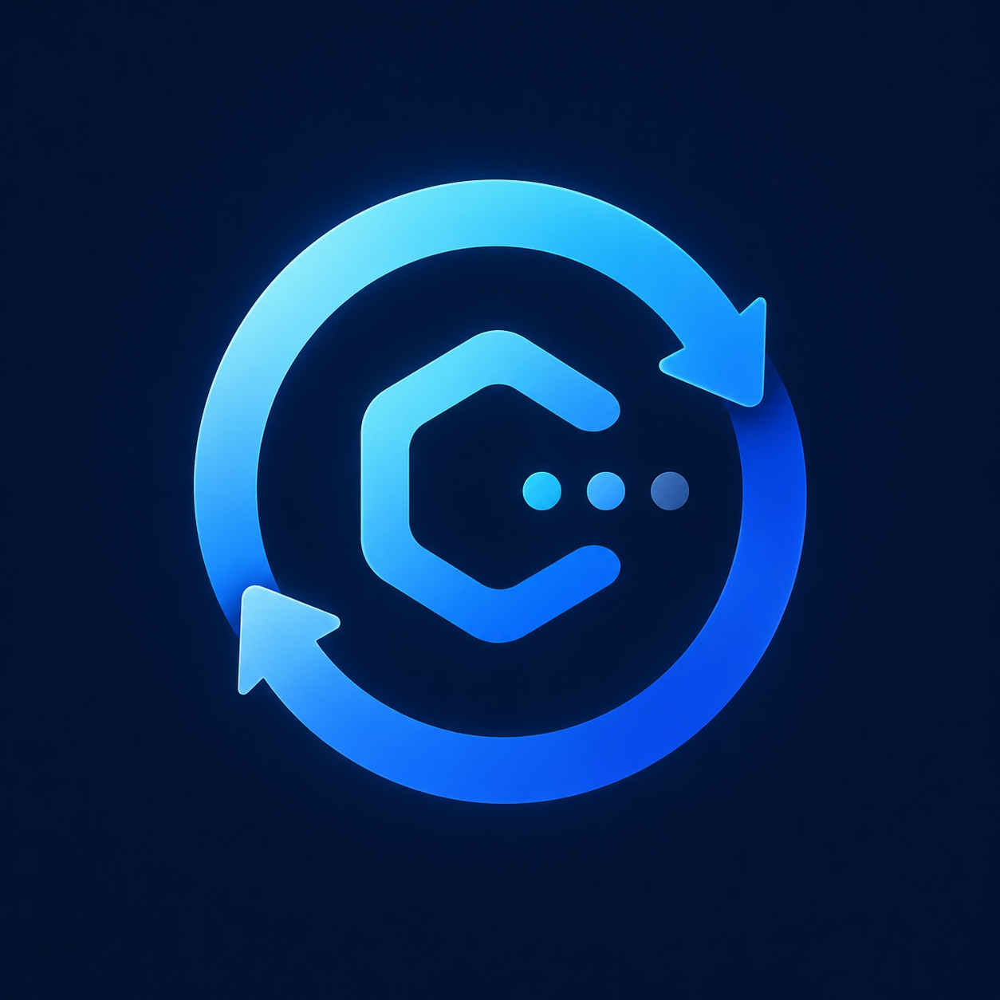

<p align="center">
  
</p>

<h1 align="center">Codex Native Dream Loop</h1>

<p align="center">
  给 Codex 用的路线记忆：留下已经赢过的路径，拒绝薄弱经验，保持召回很小。
</p>

<p align="center">
  <a href="README.md">English</a> · 中文
</p>

<p align="center">
  
  
  
  
</p>

Codex 经常会忘记哪条路线已经跑通。Dream Loop 给它一套很小的运行记忆：`ACTIVE.md` 放当前热规则，`LEARNINGS.md` 放可复用路线，任何长期记忆都先过验证门。

它适合高频 Codex 用户：跨线程、跨 repo、跨日期反复做相似工作。它不是通用记忆平台，不是 agent runtime，也不是训练框架。

## 亮点

- **公开模型很小**：日常召回只看 `ACTIVE.md` 和 `LEARNINGS.md`。
- **复用路线**：强经验沉淀成可执行路径，而不是泛泛心得。
- **验证门**：长期记忆需要来源证据、拒绝条件和回滚线索。
- **本地优先**：安装、doctor、nightly report、fixture replay、forget 都是零依赖脚本。

## 快速开始

让 Codex 安装：

```text
Install the skills from https://github.com/JY0xLU/codex-native-dream-loop and wire them into my Codex setup.
```

或者先看 dry-run 安装计划：

```bash
python scripts/install.py --codex-home ~/.codex
```

确认后再应用：

```bash
python scripts/install.py --codex-home ~/.codex --apply
```

发布或安装前检查仓库：

```bash
python scripts/doctor.py
```

生成维护报告：

```bash
python scripts/nightly_report.py --memory-root templates/global/.codex/memory
```

运行 fixture replay：

```bash
python scripts/nightly_report.py replay --fixtures-root examples/minimal-global/.codex/memory/fixtures
```

从默认召回移除一条记忆，同时保留 tombstone 审计：

```bash
python scripts/memoryctl.py forget LRN-YYYYMMDD-001 --memory-root ~/.codex/memory --reason "user requested removal"
```

## 目录

- [为什么存在](#为什么存在)
- [公开模型](#公开模型)
- [闭环怎么工作](#闭环怎么工作)
- [验证门](#验证门)
- [核心 Skills](#核心-skills)
- [自动化](#自动化)
- [后台机制](#后台机制)
- [手动安装](#手动安装)

## 为什么存在

很多 agent 不是不会做事，而是路线会漂移：

- 有效路径被反复从零发现
- 旧经验散在长对话里
- 临时规则留得太久
- plugin 和 skill 找得太晚
- 记忆层越加越多，却没有更清楚

这个仓库的目标是让下一次行动比上一次更省、更快、更稳。

它只把两个文件放到日常心智模型里：

- `ACTIVE.md`
  - 现在就应该影响行为的热规则
- `LEARNINGS.md`
  - 已验证、可跨任务复用的路线记忆

其他内容都留在后台做审计和回滚。

## 公开模型

对外只保留两层。

### `ACTIVE.md`

`ACTIVE.md` 是热层。

适合放：

- 临时但重要的规则
- 当前热路线
- 阶段性、应该立刻影响下一次任务的行为

如果一条内容不再影响近期决策，就不应该继续留在这里。

### `LEARNINGS.md`

`LEARNINGS.md` 是路线记忆层。

它应该像一套路由表，而不是心得堆。好的 entry 至少回答：

- 适合哪类任务
- 应该先走哪条路
- 为什么这条路赢
- 最近何时验证过
- 有什么证据
- 什么情况下应该回退或避免

## 闭环怎么工作

工作循环是：

`recall -> choose -> search if needed -> execute -> land or quarantine -> consolidate`

落到实际步骤：

1. 先从 `ACTIVE.md` 和 `LEARNINGS.md` 里只取最小相关片段。
2. 如果已有路线明显适用，就先复用。
3. 如果把握还不够高，再让 `capability-evolution` 按顺序搜索：已启用官方插件 -> 可安装官方插件 -> 本地 skills -> 可信 GitHub 项目。
4. 让搜索过程可观察：记录查过哪些层、哪些层被跳过或阻塞、哪个候选获胜、哪些候选失败，以及是否真的触达外部搜索。
5. 当前任务只选一条获胜路线执行，不把多条竞争路线同时固化。
6. 用 `capture-memory` 直接把明确强信号落到 `ACTIVE.md` 或 `LEARNINGS.md`；只有推断型、未验证信号才进 `inbox/`。
7. 用 `dream-consolidate` 在维护时刷新热层、强化路线记忆、清空未决信号，并把淘汰路线归档。

## 验证门

Dream Loop 会验证长期记忆改动，但不把自己变成重型优化框架。

在一条路线、偏好或流程进入长期记忆之前，维护 pass 至少要回答：

- 它来自哪一次真实任务、明确纠正、repo 审计或重复失败
- 它是否真的能让上一次结果变好
- 它应该成为 `LEARNINGS.md` 的长期路线，还是只该暂时放进 `ACTIVE.md`
- 什么证据会让它被拒绝、退回隔离或归档
- 如果以后证明它错了，怎么回滚

对于判断较重的改动，`dream-consolidate` 应先生成 staged proposal：接受哪些编辑、拒绝哪些候选、证据是什么、reviewer/subagent 怎么看、目标层是哪一个。staging 只是审计产物，不是第三个公开记忆层。日常心智模型仍然只有 `ACTIVE.md` 和 `LEARNINGS.md`。

## 不臃肿的质量控制

Dream Loop 的改进重点不是增加更多公开层，而是让路线选择更准：能复用已知路线就先复用，把握不足时才要求可观察 discovery，验证证据保持短小，凡是需要大框架才能证明的小记忆改动都应该被拒绝或暂缓。

实现改进时应保留一个清晰目标，把互不影响的工作拆开处理，最后只让通过 gate 的改动落地。

## 核心 Skills

这套系统主要由三个 skill 组成：

- `capture-memory`
  - 明确强信号直接落层；推断型未验证信号短暂隔离
- `capability-evolution`
  - 路线发现、能力验证、能力选择，以及可审计的搜索证据
- `dream-consolidate`
  - 维护 `ACTIVE.md`、强化 `LEARNINGS.md`、处理剩余 inbox、记录审计

它们共同服务一个目标：

**先复用已经赢过的路线，不够时再扩大搜索。**

## 自动化

这套系统默认只需要一个 recurring automation，而不是越拆越多的定时 agent。

这个 automation 每次运行要同时完成六件事：

- 维护双层 memory
- 审计当前 repo / PR 轮次
- 检查已安装 custom skills 是否仍然匹配 automation prompt
- 报告真实 reviewer / subagent 证据，或说明为什么走低风险单代理快路
- 检查 automation 自己的 prompt 有没有落后
- 给出下一轮最小可执行改进建议

它在 repo 层只做审计和建议，不静默修改跟踪文件。

## 后台机制

系统仍然保留一些后台机制，但它们不再是主要心智模型：

- `inbox/`
  - 只用于推断型、未验证、仍有冲突的短期隔离信号
- `AUDIT_LOG.md`
  - 最小化的晋升、拒绝、归档、回滚痕迹
- `ARCHIVE/`
  - 退役或被替代的内容，用于保留可追溯性

`inbox/` 不是第三个公开记忆层。明确强信号不应该长期停在里面。

## 手动安装

1. 把 `skills/capture-memory/`、`skills/capability-evolution/` 和 `skills/dream-consolidate/` 复制到 `$CODEX_HOME/skills/` 或 `~/.codex/skills/`。
2. 把 `templates/global/` 复制到你的 Codex home 作为起始结构。
3. 把 `AGENTS.md` 片段接入你的全局入口或项目入口。
4. 日常优先读 `ACTIVE.md`，其次读 `LEARNINGS.md`。
5. 需要找更优路线时，用 `capability-evolution` 扩大搜索。
6. 用 `capture-memory` 直接落明确强信号；只把未决信号放进 `inbox/`。
7. 运行单一 Dream Loop automation，在维护时刷新热层、处理未决信号、审计 repo/PR、检查 custom skill 对齐与 prompt drift、报告真实 reviewer 证据，并给出下一轮建议。

如果你的 Codex 版本支持本地插件注册，仓库也包含 `.codex-plugin/plugin.json`。插件入口是推荐方向，但手动安装路径仍应保留作为回退。

静态 HTML 报告：

```bash
python scripts/nightly_report.py --memory-root templates/global/.codex/memory --format html --output report.html
```

## 什么叫效果变好了

这套系统真正跑顺之后，会有这些变化：

- 新任务不再频繁从零开始
- `ACTIVE.md` 会一直很短，而且一眼能看出现在哪些规则重要
- `LEARNINGS.md` 更像路线库，不像心得堆
- 明确纠正和稳定偏好会很快落层，而不是在 `inbox/` 里拖着
- plugin 和 skill 会在需要时被主动找出来
- 失败或淘汰路线会被归档，而不是静默消失
- 系统更快了，但没有变得更乱
